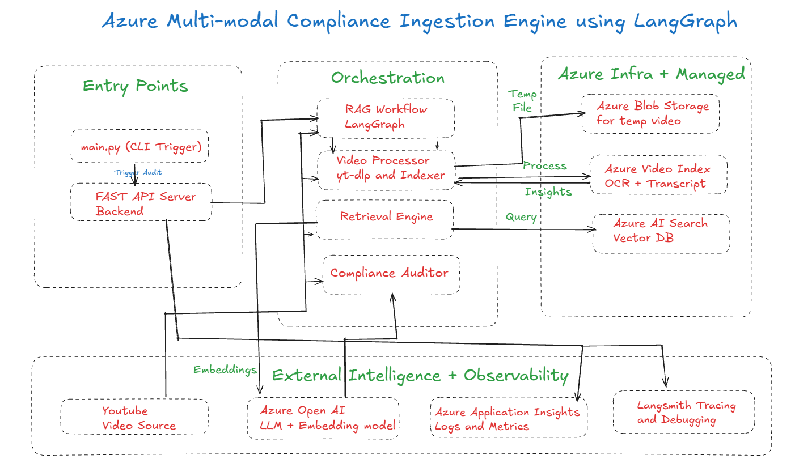

# Brand Guardian AI

> An intelligent, agentic pipeline that automatically audits video advertisements for brand compliance violations using Azure AI services and Google Gemini.

[](https://www.python.org/downloads/)
[](https://fastapi.tiangolo.com/)
[](https://langchain-ai.github.io/langgraph/)
[](https://azure.microsoft.com/)

---

## Overview

Brand Guardian AI is a production-grade compliance auditing system built for marketing and legal teams. It accepts a YouTube video URL, extracts its spoken content and on-screen text using Azure Video Indexer, retrieves relevant regulatory rules from a vector knowledge base using RAG (Retrieval-Augmented Generation), and uses Google Gemini to identify violations — all in a single automated pipeline.

**Real-world example:** Given a Neutrogena advertisement featuring John Cena, the system correctly identifies:
- **Missing FTC paid endorsement disclosure** — John Cena is introduced as "the new face of Neutrogena Ultra Shear sunscreen" with no explicit paid partnership disclosure in audio or video (CRITICAL)
- **Ad duration violation** — 30.1 seconds exceeds the 15-second maximum for unskippable YouTube ads (HIGH)

---

## System Architecture



The diagram above shows the full multi-modal compliance ingestion engine. The pipeline has three logical layers:

**Entry Points** — either `main.py` (CLI) or the FastAPI server accepts a YouTube URL to trigger the audit.

**Orchestration** — LangGraph coordinates four sub-components in a stateful DAG:
1. **Video Processor** (`yt-dlp` + Azure Video Indexer) — downloads and processes the video
2. **Retrieval Engine** (Gemini Embeddings + Azure AI Search) — retrieves relevant rules via RAG
3. **Compliance Auditor** (Gemini 2.5 Flash) — analyzes content against retrieved rules

**Azure Infrastructure** — managed cloud services handle all heavy compute:
- Azure Video Indexer for OCR + speech-to-text
- Azure AI Search as the vector database
- Azure Blob Storage for video artifacts

---

## Pipeline Flow (Node Graph)

```
[YouTube URL]
      │
      ▼
┌─────────────────────────────────────────────┐
│              Node 1: Indexer                │
│                                             │
│  1. yt-dlp downloads .mp4 locally           │
│  2. Upload to Azure Video Indexer           │
│  3. Poll every 30s until state=Processed    │
│  4. Extract transcript (speech-to-text)     │
│  5. Extract OCR (on-screen text)            │
└───────────────────────┬─────────────────────┘
                        │
                        │  transcript + ocr_text + video_metadata
                        ▼
┌─────────────────────────────────────────────┐
│              Node 2: Auditor                │
│                                             │
│  1. Embed transcript+OCR → Gemini vector    │
│  2. Similarity search → top 3 rules (RAG)  │
│  3. Gemini 2.5 Flash → structured JSON      │
│  4. Parse compliance_results + report       │
└───────────────────────┬─────────────────────┘
                        │
                        ▼
               JSON Audit Report
            (PASS / FAIL + violations)
```

The graph is orchestrated using **LangGraph** — a stateful directed acyclic graph where each node reads from and writes to a shared `VideoAuditState` TypedDict. Fields like `compliance_results` and `errors` use `operator.add` so multiple nodes can safely append without overwriting each other.

---

## Tech Stack

| Layer | Technology | Purpose |
|---|---|---|
| Pipeline Orchestration | LangGraph | Stateful DAG, node coordination |
| Video Processing | Azure Video Indexer | Speech-to-text + OCR extraction |
| LLM (Chat) | Google Gemini 2.5 Flash | Compliance analysis + report generation |
| Embeddings | Google Gemini Embedding 001 | Text → vector conversion for RAG |
| Vector Store / RAG | Azure AI Search | Semantic rule retrieval |
| API Framework | FastAPI + Uvicorn | REST API with Swagger UI |
| Observability | Azure Monitor + Application Insights | End-to-end HTTP tracing |
| LLM Tracing | LangSmith | Prompt/response logging with latency |
| YouTube Download | yt-dlp | Resilient video download |
| Azure Authentication | DefaultAzureCredential | Secure credential chain (Azure CLI) |
| Package Manager | uv | Fast Python dependency management |

---

## Live Demo: API Response

The Swagger UI at `http://localhost:8000/docs` shows the live audit result for the Neutrogena/John Cena advertisement:

```
POST http://localhost:8000/audit
Content-Type: application/json

{
  "video_url": "https://youtu.be/dT7S75eYhcQ"
}
```

**HTTP 200 Response:**

```json
{
  "session_id": "58261144-a68c-451d-a0a5-ff140934dc1a",
  "video_id": "vid_58261144",
  "status": "FAIL",
  "final_report": "The audit identified two significant compliance violations. Firstly, there is a critical lack of disclosure regarding John Cena's material connection (e.g., paid endorsement) as the 'new face' of Neutrogena Ultra Shear sunscreen, which is a fundamental requirement for transparent endorsements and should be present in both audio and video. Secondly, the video's duration of 30.1 seconds exceeds the maximum allowed length for unskippable ad formats (15 seconds, or 20-30 seconds in some regions), posing a compliance risk if deployed as an unskippable ad on YouTube or Google video partners.",
  "compliance_results": [
    {
      "category": "Endorsement Disclosure",
      "severity": "CRITICAL",
      "description": "The video features John Cena as 'the new face of Neutrogena Ultra Shear sunscreen,' which constitutes an endorsement. Official regulatory rules emphasize that disclosures are more likely to be noticed when made in both audio and video. However, there is no explicit disclosure in either the audio transcript or the on-screen text indicating a material connection (e.g., paid endorsement) between John Cena and Neutrogena, which is a fundamental requirement for transparent endorsements."
    },
    {
      "category": "Ad Format/Duration",
      "severity": "HIGH",
      "description": "The video has a duration of 30.1 seconds. Official regulatory rules state that unskippable video ads on platforms like YouTube should last for 15 seconds or less (or 20-30 seconds in some regions). The video's duration of 30.1 seconds exceeds the maximum allowed for unskippable ad formats, even in regions with extended limits, posing a compliance risk if presented as an unskippable advertisement."
    }
  ]
}
```

> **Note:** Screenshots of the Swagger UI response and Application Map are in the `docs/` folder once generated.

---

## Observability: Azure Application Insights

The Application Map in Azure Monitor captures every HTTP dependency call made during a pipeline run in real-time:

| Dependency | Avg Latency | Calls | Purpose |
|---|---|---|---|
| `management.azure.com` | 1.5s | 9 | ARM token exchange for Video Indexer auth |
| `api.videoindexer.ai` | 509.8ms | 9 | Video upload, processing, insight extraction |
| `project-te...indows.net` | 496.8ms | 6 | Azure AI Search vector queries |
| `api.smith.langchain.com` | 411.1ms | 8 | LangSmith LLM call tracing |
| `www.youtube.com` | 241.5ms | 4 | YouTube video download |
| `rr3---sn-g...evideo.com` | 88ms | 2 | YouTube CDN video stream |
| `169.254.169.254` | 6.5ms | 4 | Azure Instance Metadata Service (IMDS) |

All instrumentation is automatic — the OpenTelemetry SDK hooks into FastAPI and traces every outbound HTTP call with zero manual code changes.

**LangSmith** logs every Gemini LLM invocation with full prompt text, response, token count, and latency at `smith.langchain.com`.

---

## Prerequisites

- Python 3.12+
- [uv](https://docs.astral.sh/uv/) package manager (`curl -LsSf https://astral.sh/uv/install.sh | sh`)
- [Azure CLI](https://learn.microsoft.com/en-us/cli/azure/install-azure-cli) installed and logged in (`az login`)
- Active accounts for:
  - Microsoft Azure (Student or paid — Video Indexer + AI Search + Application Insights)
  - Google AI Studio (free API key with billing-linked project)
  - LangSmith (free, optional — for LLM tracing)

---

## Azure Services Required

| Service | Tier | Purpose |
|---|---|---|
| Azure Video Indexer | Standard | Video processing, speech-to-text, OCR |
| Azure AI Search | Basic | Vector store for RAG knowledge base |
| Azure Application Insights | Free | Telemetry and observability |
| Azure Storage Account | Standard LRS | Video artifact storage (future use) |

---

## Setup

### 1. Clone and install dependencies

```bash
git clone https://github.com/Siddanth-S/Brand-Complaince-Report-Generator.git
cd Brand-Complaince-Report-Generator
uv sync
```

This installs all 137 packages (LangChain, LangGraph, FastAPI, Azure SDKs, Google GenAI, etc.) into an isolated virtual environment.

### 2. Configure environment variables

```bash
cp .env.example .env
```

Open `.env` and fill in your credentials:

```bash
# Google Gemini — aistudio.google.com → Get API Key
# Must be from a project with billing enabled (free quota requires billing linked)
GOOGLE_API_KEY=""

# Azure AI Search — Portal → AI Search resource → Overview / Keys
AZURE_SEARCH_ENDPOINT=""         # e.g. https://your-name.search.windows.net
AZURE_SEARCH_API_KEY=""          # Portal → Settings → Keys → Primary admin key
AZURE_SEARCH_INDEX_NAME=""       # e.g. brand-compliance-rules

# Azure Video Indexer — Portal → Video Indexer resource → Overview
AZURE_VI_ACCOUNT_ID=""           # Portal → Overview → Account ID
AZURE_VI_LOCATION=""             # e.g. centralindia, eastus
AZURE_VI_NAME=""                 # Resource name in Azure
AZURE_SUBSCRIPTION_ID=""         # Portal → Subscriptions → Subscription ID
AZURE_RESOURCE_GROUP=""          # Resource group containing VI

# Azure Application Insights (optional — enables Application Map)
APPLICATIONINSIGHTS_CONNECTION_STRING=""

# LangSmith (optional — enables LLM call tracing)
LANGCHAIN_TRACING_V2=true
LANGCHAIN_ENDPOINT="https://api.smith.langchain.com"
LANGCHAIN_API_KEY=""
LANGCHAIN_PROJECT=""
```

### 3. Authenticate with Azure

```bash
az login
```

This opens a browser for Azure login. Required so `DefaultAzureCredential` can obtain the ARM token needed for Video Indexer authentication.

### 4. Build the knowledge base (one-time)

Index the compliance PDFs into Azure AI Search:

```bash
uv run python backend/scripts/index_documents.py
```

This reads the two PDFs in `backend/data/`, chunks them into 37 segments, generates Gemini embeddings for each chunk, and uploads them to Azure AI Search (auto-creates the index if it doesn't exist):

```
============================================================
Environment Configuration Check:
Embedding Model: models/gemini-embedding-001 (Google Gemini)
AZURE_SEARCH_ENDPOINT: https://your-name.search.windows.net
AZURE_SEARCH_INDEX_NAME: brand-compliance-rules
============================================================
✓ Embeddings model initialized successfully
✓ Vector store initialized for index: brand-compliance-rules
Found 2 PDFs to process: [...]
============================================================
✅ Indexing Complete! The Knowledge Base is ready.
Total chunks indexed: 37
============================================================
```

---

## Running the Pipeline

### CLI mode

```bash
uv run python main.py
```

Edit `video_url` in `main.py` to audit any YouTube video. The pipeline downloads the video, processes it, and prints the full compliance report to the terminal.

### API mode (with Swagger UI)

Start the FastAPI server:

```bash
uv run uvicorn backend.src.api.server:app --reload
```

The server starts at `http://localhost:8000`.

| Endpoint | Method | Description |
|---|---|---|
| `/health` | GET | Health check — returns `{"status": "healthy"}` |
| `/audit` | POST | Run a full compliance audit on a video URL |
| `/docs` | GET | Interactive Swagger UI for testing the API |

**Example curl request:**

```bash
curl -X POST http://localhost:8000/audit \
  -H "Content-Type: application/json" \
  -d '{"video_url": "https://youtu.be/dT7S75eYhcQ"}'
```

The pipeline takes 2-5 minutes to complete per video (dominated by Azure Video Indexer processing time).

---

## Knowledge Base

The RAG knowledge base is built from two compliance documents in `backend/data/`:

| Document | Contents | Chunks |
|---|---|---|
| `1001a-influencer-guide-508_1.pdf` | FTC Influencer & Endorsement Guidelines | ~20 chunks |
| `youtube-ad-specs.pdf` | YouTube Ad Specifications & Format Rules | ~17 chunks |

The indexer uses `RecursiveCharacterTextSplitter` with 1000-character chunks and 200-character overlap to preserve context across chunk boundaries. Each chunk is embedded with `models/gemini-embedding-001` (768 dimensions) and stored in Azure AI Search.

To add more compliance documents: place PDFs in `backend/data/` and re-run the indexing script. The vector store supports incremental additions.

---

## Project Structure

```
ComplianceQAPipeline/
├── main.py                          # CLI entry point — runs pipeline directly
├── pyproject.toml                   # Dependencies managed by uv
├── .env.example                     # Environment variable template (copy to .env)
├── docs/                            # Screenshots and diagrams
│   ├── architecture-diagram.png     # Full system architecture
│   ├── application-map.png          # Azure Application Insights Application Map
│   └── swagger-response.png         # FastAPI Swagger UI audit response
├── backend/
│   ├── data/                        # Compliance PDF source documents
│   │   ├── 1001a-influencer-guide-508_1.pdf
│   │   └── youtube-ad-specs.pdf
│   ├── scripts/
│   │   └── index_documents.py       # One-time knowledge base indexer
│   └── src/
│       ├── api/
│       │   ├── server.py            # FastAPI REST API (POST /audit, GET /health)
│       │   └── telemetry.py         # Azure Monitor + OpenTelemetry setup
│       ├── graph/
│       │   ├── state.py             # LangGraph shared state schema (TypedDict)
│       │   ├── nodes.py             # Indexer node + Auditor node functions
│       │   └── workflow.py          # DAG definition, graph compilation
│       └── services/
│           └── video_indexer.py     # Azure Video Indexer service wrapper
└── azure_functions/                 # Azure Functions deployment (planned)
```

---

## How It Works — Deep Dive

### State Management (LangGraph)

The shared state between nodes is defined as a `TypedDict` in `state.py`:

```python
class VideoAuditState(TypedDict):
    # Inputs
    video_url: str
    video_id: str
    # Extracted data (set by Node 1)
    transcript: str
    ocr_text: List[str]
    video_metadata: Dict[str, Any]
    # Outputs (set by Node 2)
    compliance_results: Annotated[List[ComplianceIssue], operator.add]
    final_status: str
    final_report: str
    # Errors (any node can append)
    errors: Annotated[List[str], operator.add]
```

`operator.add` on `compliance_results` and `errors` means nodes **append** to the list rather than replacing it — safe for concurrent or sequential multi-node pipelines.

### Node 1 — Indexer (`index_video_node`)

1. Reads `video_url` from state
2. Downloads the YouTube video with `yt-dlp` (android player client + browser User-Agent to bypass bot detection)
3. Uploads the `.mp4` to Azure Video Indexer via multipart REST API
4. Authenticates with a two-token chain: `DefaultAzureCredential` → ARM token → VI account token
5. Polls every 30 seconds until `state == "Processed"`
6. Extracts all transcript lines and OCR lines from the VI insights JSON
7. Writes `transcript`, `ocr_text`, `video_metadata` back to shared state

### Node 2 — Auditor (`audit_content_node`)

1. Reads `transcript` and `ocr_text` from state
2. Concatenates them into a single query string
3. Calls `GoogleGenerativeAIEmbeddings` to embed the query
4. Runs `AzureSearch.similarity_search(query, k=3)` to retrieve the 3 most relevant compliance rules
5. Builds a structured prompt with the retrieved rules as context
6. Invokes `ChatGoogleGenerativeAI(model="gemini-2.5-flash")` to generate a JSON compliance report
7. Strips any markdown code fences (` ```json ``` `) from the response with regex
8. Parses the JSON and returns `compliance_results`, `final_status`, `final_report`

### Azure Video Indexer Authentication

The Video Indexer API requires a two-step token exchange that is handled automatically:

```
DefaultAzureCredential (az login / Managed Identity)
    → ARM access token (scope: https://management.azure.com)
    → POST https://management.azure.com/subscriptions/{sub}/resourceGroups/{rg}/
          providers/Microsoft.VideoIndexer/accounts/{name}/generateAccessToken
    → VI account access token (used for all VI API calls)
```

---

## Observability Setup

### Azure Application Insights

Set `APPLICATIONINSIGHTS_CONNECTION_STRING` in `.env`. The `setup_telemetry()` call in `server.py` hooks the OpenTelemetry Azure Monitor exporter into FastAPI's ASGI middleware. Every inbound request and outbound HTTP call is traced automatically and appears in the Application Map within ~2 minutes.

### LangSmith

Set `LANGCHAIN_API_KEY` and `LANGCHAIN_PROJECT` in `.env` with `LANGCHAIN_TRACING_V2=true`. LangChain automatically sends every LLM invocation (prompt, response, latency, token count) to `smith.langchain.com` under your project.

---

## Environment Variables Reference

| Variable | Required | Where to Find |
|---|---|---|
| `GOOGLE_API_KEY` | Yes | aistudio.google.com → Get API Key (billing-enabled project) |
| `AZURE_SEARCH_ENDPOINT` | Yes | AI Search resource → Overview → URL |
| `AZURE_SEARCH_API_KEY` | Yes | AI Search resource → Settings → Keys → Primary admin key |
| `AZURE_SEARCH_INDEX_NAME` | Yes | Choose any name (e.g. `brand-compliance-rules`) |
| `AZURE_VI_ACCOUNT_ID` | Yes | Video Indexer resource → Overview → Account ID |
| `AZURE_VI_LOCATION` | Yes | Azure region (e.g. `centralindia`) |
| `AZURE_VI_NAME` | Yes | Video Indexer resource name in Azure |
| `AZURE_SUBSCRIPTION_ID` | Yes | Portal → Subscriptions → Subscription ID |
| `AZURE_RESOURCE_GROUP` | Yes | Resource group name containing Video Indexer |
| `AZURE_STORAGE_CONNECTION_STRING` | No | Storage Account → Access keys → Connection string |
| `APPLICATIONINSIGHTS_CONNECTION_STRING` | No | App Insights resource → Overview → Connection String |
| `LANGCHAIN_TRACING_V2` | No | Set to `true` to enable LangSmith tracing |
| `LANGCHAIN_ENDPOINT` | No | `https://api.smith.langchain.com` (leave as-is) |
| `LANGCHAIN_API_KEY` | No | smith.langchain.com → Settings → API Keys |
| `LANGCHAIN_PROJECT` | No | Project name in LangSmith (e.g. `brand-guardian`) |

---

## Troubleshooting

| Error | Cause | Fix |
|---|---|---|
| `DefaultAzureCredential failed` | Azure CLI not logged in | Run `az login` |
| `quota limit: 0` on Gemini API | Project has no billing linked | Link billing in Google Cloud Console for the project |
| `404` on embedding model | Wrong model name | Use `models/gemini-embedding-001` (not `text-embedding-004`) |
| `No module named 'langchain_google_genai'` | venv not activated | Run commands with `uv run python ...` |
| Video stuck at `Processing` | VI quota or network issue | Check Azure Video Indexer portal for error details |

---

## Built With

- [LangGraph](https://langchain-ai.github.io/langgraph/) — agentic pipeline orchestration
- [LangChain](https://python.langchain.com/) — LLM abstractions and RAG tooling
- [Google Gemini](https://aistudio.google.com/) — LLM and embedding model
- [Azure Video Indexer](https://learn.microsoft.com/en-us/azure/azure-video-indexer/) — video AI
- [Azure AI Search](https://learn.microsoft.com/en-us/azure/search/) — vector database
- [FastAPI](https://fastapi.tiangolo.com/) — REST API framework
- [Azure Monitor](https://learn.microsoft.com/en-us/azure/azure-monitor/) — observability
